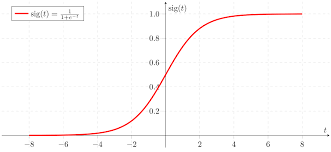
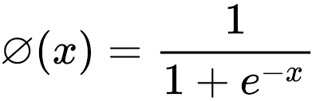
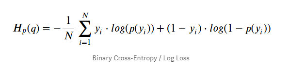
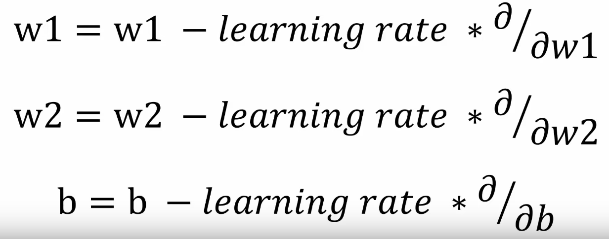
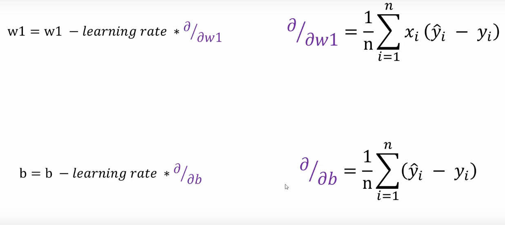

# Neural-network-from-scratch

Created a neural network completely from scratch using only python and numpy and trained it on a small scaled custom made dataset. Also trained a sequential single layered neural network with the same parameters and achieved almost identical results.

The dataset contains 3 features : Age, Affordability, and Bought_insurance

## Custom Neural Network implementation and parameters
### Activation function : Sigmoid
As we have to do a binary prediction of whether someon bought insurance or not, sigmoid is an ideal choice.

### Loss function : Binary_crossentropy / Log loss
For classification models predicting the probability, the loss function most commonly used is cross entropy.

### Gradient Descent
initialized the weights(w1,w2) with 1 , bias with 0, and learning rate with 0.5

For each epoch a weighted sum is calculated   ->    **w1 * Age + w2 * Affordability**

Converted into predictions    ->    **Sigmoid(weighted_sum)**

Calculates loss   ->    **Log_loss(y_true, y_predicted)**

Re-adjusting weights and biases using the following formula : 

## Tensorflow Keras vs Custom Neural Network
Trained the data with Keras using the same parameters with the following results and compared difference

Tensorflow results :

**w1** = 4.745832

**w2** = 1.5486312

**bias** = -3.0031297

**loss** = 0.4778

Custom neural network results :

**w1** = 4.632335

**w2** = 1.710244

**bias** = -3.116969

**loss** = 0.4686

Difference :

**w1 -> 2.39 %**

**w2 -> -10.43 %**

**bias -> -3.79 %**

**loss -> 0.92 %** (ours is marginally better)
